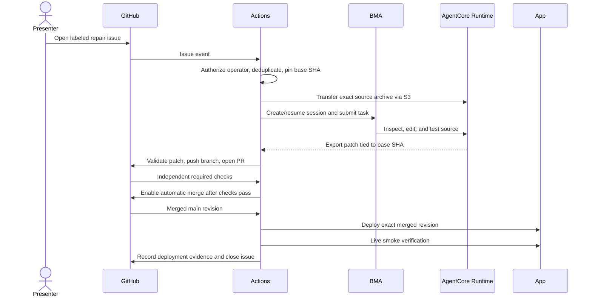

# Issue-to-deployment integration

## Intended flow

Automatic merge and deployment after passing required checks are part of the
agreed demo. Failed or missing checks must leave the PR unmerged.

## What exists now

The app, independent acceptance test, issue template, event parser, and BMA
request builder are present. No BMA calls, durable records, source transport,
PR publication, auto-merge, or deployment are implemented yet. The issue workflow
reports `prepared` and explicitly identifies that limit.

## Next checkpoint: one issue produces one real PR

1. Provision an AgentCore Runtime running the supported Codex exec server,
   development tools, and persistent workspace. Prove a real BMA file edit.
2. Add Actions OIDC, the BMA caller role, session role, Runtime execution role,
   and a private source/artifact bucket.
3. Save an execution record keyed by repository + issue; accept each event
   once. The current deterministic event ID is an identity, not durable dedup.
4. Export source at the captured base SHA, stage it in the Runtime, create or
   resume BMA, and submit the assignment.
5. Observe terminal turn results and durable items. Accepted input or an idle
   session alone does not establish success. Bound execution and retries.
6. Export a patch with new files and deletions. Verify the base SHA and reject
   paths outside `src/`, traversal, symlinks, unexpected file types, and edits
   to checks, dependencies, or workflows before applying anything.
7. Use a repository-scoped GitHub App installation token to publish a branch
   and PR. Link it with `Refs #N`; do not close the issue at merge time.

## Then checks, merge, and deployment

- Require `Build, unit, and board checks` and `Repair acceptance` with branch
  rules and no manual review gate for the demo happy path.
- Allowlist automatically merged branches using the durable assignment record;
  a `codex/` prefix or a PR label alone is not authorization.
- Protect workflow/test files and enforce the application-only patch boundary.
  Loading the base acceptance test is useful but is not the entire trust boundary.
- Enable auto-merge only for validated agent repair PRs.
- Deploy on a merge to `main` using the actual merged SHA.
- Run `APP_URL=<deployed-url> npm run test:repair` against the deployed app,
  verifying the deployment's revision separately before closing the issue.
- Report failures truthfully. Add bounded same-session repair retries only
  after the single-attempt path works.

## Persistence demonstration

Keep issue → BMA session → Runtime workspace identity outside Actions runners.
Store an uncommitted marker outside the transferred repository. After stopping
and replacing compute, show that the marker survives and a `/codex` comment
continues the same conversation. A fresh clone is not evidence of persistence.

For follow-ups after a merge, stage current `main` in a new repair branch while
retaining session context and files outside the repository. AgentCore managed
session storage is one candidate for a same-session demo; evaluate its expiry
and Runtime-version lifecycle before selecting it. EFS is another choice when
storage must have an independent lifecycle.

## References

- AWS BMA preview REST API reference:
  https://docs.aws.amazon.com/bedrock/latest/userguide/bedrock-managed-agents-openai-api-reference.html
- AgentCore Runtime example:
  https://docs.aws.amazon.com/bedrock/latest/userguide/bedrock-managed-agents-openai-agentcore-runtime.html
- GitHub workflow trigger behavior:
  https://docs.github.com/en/actions/how-tos/write-workflows/choose-when-workflows-run/trigger-a-workflow
